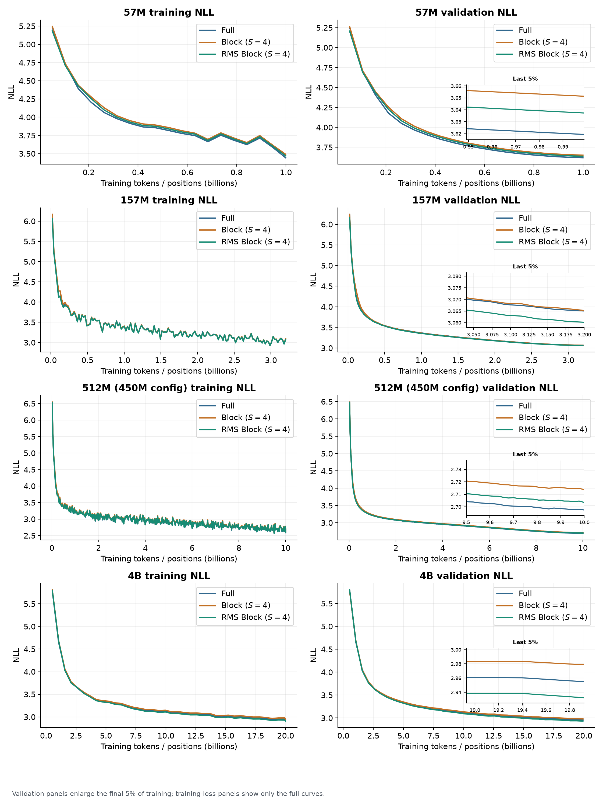

# RMS-normalized Block Attention Residuals

Code, results, and reproduction instructions for **RMS Block AttnRes**.

## Intuition

Block AttnRes compresses several residual outputs by adding their raw vectors. The problem is that an output with a larger RMS then has more influence on the direction of the compressed representation, even when its larger magnitude does not make it more informative. Normalizing the completed sum cannot undo this relative weighting.

RMS Block fixes the problem by RMS-normalizing each output before it is added to a completed block. Compression therefore combines normalized directions instead of weighting those directions by their original magnitudes.

Formally, Block AttnRes stores

$$
b_B=\sum_{i\in B}y_i.
$$

Writing each output as $y_i=r_i u_i$, where $r_i$ is the RMS of $y_i$ and $u_i$ is its unit-RMS direction, gives

$$
b_B=\sum_{i\in B}r_i u_i.
$$

RMS Block changes the completed-block summary to

$$
b_B^{\mathrm{RMS}}=\sum_{i\in B}u_i.
$$

Each source enters the sum at the same RMS, while alignment and cancellation between directions remain intact.

In the released implementation, this normalization happens when a block is completed. The current incomplete block and the embedding remain raw.

## Results

We compare Full AttnRes, Block AttnRes, and RMS Block AttnRes. The block size used in these experiments is $S=4$ residual outputs.

| Model / training budget | Metric | Full | Block | RMS Block | RMS Block vs. Block PPL |
|---|---|---:|---:|---:|---:|
| 56.84M / 1B labels | Test NLL (PPL) | **3.63247 (37.80597)** | 3.66535 (39.06987) | 3.65084 (38.50690) | **−1.44%** |
| 157.43M / 3.2B labels | Test NLL (PPL) | 3.08283 (21.82007) | 3.08348 (21.83416) | **3.07799 (21.71467)** | **−0.55%** |
| 512.42M / 10B labels | Test NLL (PPL) | **2.71660 (15.12881)** | 2.73308 (15.38015) | 2.72306 (15.22677) | **−1.00%** |
| 4.02B / 20B token positions | Validation NLL (PPL) | 2.95484 (19.19858) | 2.97866 (19.66140) | **2.93221 (18.76909)** | **−4.54%** |

RMS Block improves on the original Block method at all four tested scales.



The 4B runs also support a matched-loss comparison. Block reaches validation NLL 2.978657 after approximately 20B token positions. RMS Block reaches the same loss after an estimated 15.789B positions: **20.75% fewer tokens, or 1.262× higher data efficiency**. RMS Block has 2.55% lower token throughput, so the resulting training-only time-to-quality gain is **1.230×**, equivalent to 18.67% less device time.

## Reproduce

### Rebuild the public results

The tables and figures are generated from the machine-readable summaries in this repository:

```bash
python scripts/rebuild.py
python scripts/rebuild.py --figures
python scripts/validate_release.py
```

### Run the small-model comparison

Install a compatible PyTorch build, then install the remaining dependencies and fetch the tokenizer:

```bash
python -m pip install -r requirements.txt
python scripts/fetch_tokenizer.py
```

After preparing a shared dataset, launch the three variants with the same GPU count, global batch, data order, and training budget:

```bash
python small/run.py --size 57m --variant full \
  --prepared data/prepared-57m --out runs/57m-full
python small/run.py --size 57m --variant block \
  --prepared data/prepared-57m --out runs/57m-block
python small/run.py --size 57m --variant rms_block \
  --prepared data/prepared-57m --out runs/57m-rms-block
```

Available model sizes are `57m`, `157m`, and `450m`; the last name reproduces the 512.42M-parameter configuration. Use `--dry-run` to inspect a launch and `--stop-after-steps 20` for a smoke test. Data preparation, evaluation, and the exact historical settings are documented in [the experiment guide](docs/experiment_design.md).

### Port the 4B experiment

The 4B directory provides the pinned Megatron-LM base commit, patch, model configuration, key training arguments, and a generic launcher. It is a porting recipe because distributed launchers and data paths differ across clusters. See [4B reproduction and prerequisites](docs/experiment_design.md#megatron--4b-scaling).

Every reported number is mapped to a public source artifact in [EVIDENCE.md](EVIDENCE.md). Upstream revisions and licenses are recorded in [NOTICE.md](NOTICE.md) and [provenance/upstream.json](provenance/upstream.json).
